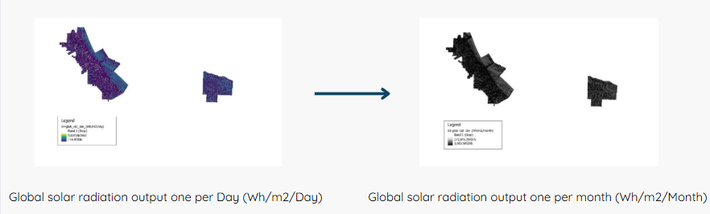
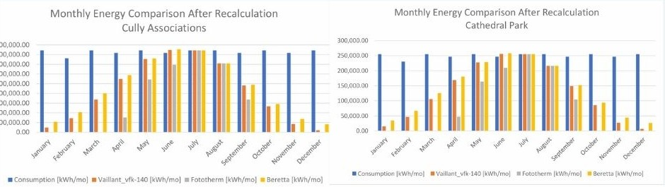
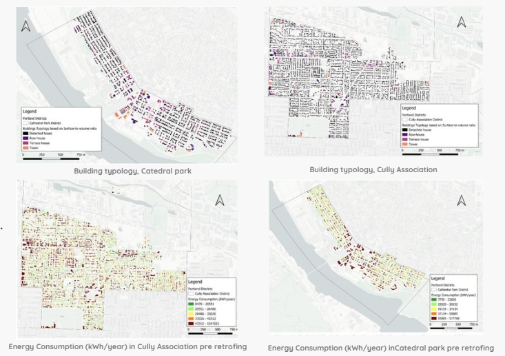
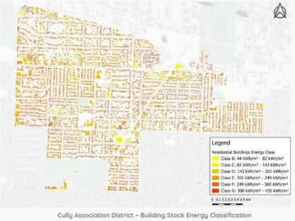
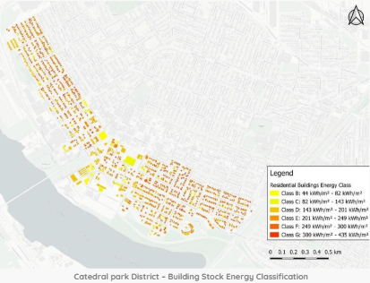
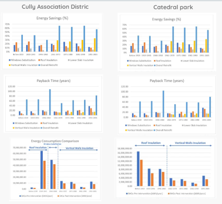

# GIS-Based Urban Energy Assessment: Solar Potential, Thermal Systems, and Retrofit Strategies in Portland, USA

This repository presents a comprehensive GIS-based urban energy assessment conducted for two districts in Portland, Oregon — **Cully Association** and **Cathedral Park**.  
The study integrates spatial analysis, solar modeling, and building energy evaluation to quantify renewable energy potential and identify effective retrofit strategies for reducing energy consumption in residential areas.

The work includes:

- Photovoltaic (PV) Energy Potential Analysis  
- Solar Thermal Domestic Hot Water (DHW) Assessment  
- Urban Building Energy Modeling & Retrofit Strategy Evaluation  
- Economic and Payback Analysis for Renewable Installations  

---

## 1. Study Area

Two districts were selected due to their contrasting morphological and rooftop characteristics:

- **Cully Association** — larger industrial rooftops, high PV suitability  
- **Cathedral Park** — compact residential forms, stable solar performance  

Both districts offer valuable insights into how urban form influences renewable energy potential.

  

---

# 2. Photovoltaic (PV) Energy Potential

## 2.1 Objectives
1. Model rooftop solar radiation using GIS-based tools.  
2. Validate radiation outputs with PVGIS data.  
3. Estimate PV energy production at building scale.  
4. Evaluate economic feasibility and payback periods.

---

## 2.2 Data Inputs

- Digital Surface Model (DSM)  
- Slope & Aspect rasters  
- Diffuse-to-global radiation ratio  
- Linke turbidity values  
- Typical radiation days (12 per year)  
- Building footprints and rooftop areas  
- Performance ratio and panel efficiency  

Solar radiation was simulated using **QGIS r.sun**, producing daily and monthly radiation maps, later validated with **PVGIS**.

  

## 2.3 Solar Radiation Modeling

The radiation modeling process included:

- Computation of direct, diffuse, and reflected radiation  
- Conversion of daily → monthly outputs  
- Extraction of radiation values per rooftop polygon  
- Validation against PVGIS (strong correlation in summer periods, higher error in winter)

  

---

## 2.4 PV Energy Estimation

### Energy per rooftop area:E1 = PR × Hs × S × η

### Energy per kWp capacity:E3 = PR × Hs × Wp / Istc

Where:  
- PR — Performance ratio  
- Hs — Solar radiation (kWh/m²)  
- S — Rooftop area  
- η — Panel efficiency  
- Wp — System peak power  
- Istc — Standard irradiance  

  

---

## 2.5 Key Findings

### Cully Association
- Larger rooftops → higher annual PV output  
- Best suited for large-scale PV installations  
- Payback period: **~17.3 years**

### Cathedral Park
- Smaller rooftops but consistent efficiency  
- Payback period: **~16.8 years**

  

### Monthly Electrical Consumption and Production – Cathedral Park District

| Month | Consumption (kWh/month) | Production (kWh/month) |
|-------|--------------------------|--------------------------|
| Jan   | 290,494.63               | 384,775.30               |
| Feb   | 262,382.25               | 615,248.79               |
| Mar   | 290,494.63               | 1,043,947.15             |
| Apr   | 281,123.84               | 1,397,416.26             |
| May   | 290,494.63               | 1,686,085.02             |
| Jun   | 281,123.84               | 1,866,675.18             |
| Jul   | 290,494.63               | 1,796,074.76             |
| Aug   | 290,494.63               | 1,528,423.08             |
| Sep   | 281,123.84               | 1,128,523.20             |
| Oct   | 290,494.63               | 756,773.56               |
| Nov   | 281,123.84               | 441,500.63               |
| Dec   | 290,494.63               | 328,451.53               |
| **Annual** | **3,420,340.00** | **12,973,894.47** |

### Cost Before and After Implementation – Cathedral Park District

| Month | C_bi (€) | C_ai (€) |
|-------|-----------|--------------|
| Jan   | 63,908.82 | 9,420.07     |
| Feb   | 57,724.09 | 35,286.65    |
| Mar   | 63,908.82 | 75,345.25    |
| Apr   | 61,847.24 | 111,629.24   |
| May   | 63,908.82 | 139,559.04   |
| Jun   | 61,847.24 | 158,585.13   |
| Jul   | 63,908.82 | 150,568.01   |
| Aug   | 63,908.82 | 123,792.85   |
| Sep   | 61,847.24 | 84,739.94    |
| Oct   | 63,908.82 | 46,627.89    |
| Nov   | 61,847.24 | 16,037.68    |
| Dec   | 63,908.82 | 3,795.69     |
| **Annual** | **752,474.80** | **955,355.46** |

---

# 3. Solar Thermal Potential Analysis

Solar thermal modeling focuses on domestic hot water (DHW) heating potential and collector sizing.

---

## 3.1 Energy Consumption Calculation

Daily DHW energy demand per person:Q_u,d = (V × ρ × c_p × ΔT) / ε

Using:  
- V = 0.06 m³/day  
- ρ = 1000 kg/m³  
- c_p = 1.163×10⁻³ kWh/kg·K  
- ΔT = 30 K  
- ε = 0.9  

**Result: 2.326 kWh/day per person**  
Scaled using district-level household sizes and days/month.

---

## 3.2 Thermal Production Equation
Q_u = A_C × H_sol × η_coll

Where:  
- A_C — Collector area  
- H_sol — Monthly radiation  
- η_coll — Collector efficiency  

---

## 3.3 Optimization of Collector Area

Initial design (30% rooftop coverage) → excessive summer production.  
To improve system performance:

### Adjust collector area so that **July demand = July production**:
A_C,July = Q_u / (H_sol × η_coll)

Benefits:
- Eliminates excess summer heat  
- Reduces installation cost  
- Improves annual energy balance  

  

  

---

## 3.4 Economic Results (Solar Thermal)

### Best collector options:
- **Cathedral Park → Vaillant Panels (~10.5 years payback)**  
- **Cully Association → Beretta Panels (~18.9 years payback)**  

---

# 4. Urban Building Energy Modeling & Retrofit Strategies

This section analyzes heating energy demand based on:

- Building typology  
- Construction period  
- Surface-to-volume ratio (S/V)  
- Shared wall conditions  
- Height differences  

  

---

## 4.1 Envelope Heat Loss Calculation

### Real Heat Loss Surface:
S1 = [(Perimeter × Height) + (Area × 2)] − Shared_Surface

### Building Volume:
V1 = (Area × Height) − (Shared_Surface × 0.4)
Outputs classify buildings into efficiency classes and reveal how form and age influence energy performance.

  
  

---

# 5. Retrofit Strategies & Energy Savings

Retrofit measures evaluated:

- Roof insulation  
- Wall insulation  
- Lower slab insulation  
- Window substitution  
- Combined retrofits  

  

### Key insights:
- Up to **42% energy reduction** for the combined retrofit  
- Roof insulation → best for older buildings  
- Wall insulation → best for post-1960 buildings  
- Lower slab insulation → shortest payback (5–7 years)  
- Window substitution → improves comfort but with higher cost
  
| Period of construction | Windows substitution | Roof insulation | Lower slab insulation | Vertical walls insulation | Overall retrofit |
|------------------------|----------------------|-----------------|------------------------|----------------------------|-------------------|
| < 1919                 | 17%                 | 24%            | 9%                     | -                          | 43%              |
| 1919–45                | 17%                 | 26%            | 8%                     | -                          | 42%              |
| 1946–60                | 15%                 | 17%            | 4%                     | -                          | 30%              |
| 1961–70                | 20%                 | 17%            | 5%                     | 29%                        | 66%              |
| 1971–80                | 25%                 | 14%            | 10%                    | 26%                        | 63%              |
| 1981–90                | 21%                 | 14%            | 8%                     | 30%                        | 66%              |
| 1991–2005              | 12%                 | 10%            | 5%                     | 34%                        | 57%              |

---

# 6. General Conclusions

### PV Systems
- Cully: highest overall production  
- Cathedral Park: more consistent seasonal performance  

### Solar Thermal
- Optimized collector area prevents overproduction  
- Best collector type varies by district  

### Retrofit Strategy
- Roof insulation: optimal for older buildings  
- Wall insulation: effective for modern structures  
- Lower slab insulation: fastest economic return  
| Building Type                               | Recommended Retrofit          | Energy Savings (%) | Payback Time (Years) | Key Benefits                                                                 | Limitations                                   |
|----------------------------------------------|------------------------------|---------------------|-----------------------|-------------------------------------------------------------------------------|-----------------------------------------------|
| Older Buildings (Pre-1960)                   | Roof Insulation 🏠           | 24–26%             | 7–15 years            | - Reduces major heat loss - Cost-effective for aging structures           | - Requires upfront investment                 |
| Newer Buildings (1961–2005)                  | Wall Insulation 🧱           | 29–34%             | 11–15 years           | - Improves thermal performance - Reduces external wall heat loss          | - Moderate installation cost                  |
| Buildings with Large Windows                 | Window Substitution 🪟       | 15–25%             | 15–20 years           | - Reduces air leakage - Improves indoor comfort                           | - High initial cost                           |
| Low-Rise Buildings with Ground Exposure      | Lower Slab Insulation 🏗️     | 5–10%              | 5–7 years             | - Fastest payback time - Reduces heat loss from the ground               | - Lower overall energy savings                |
| All Building Types (Max Savings Potential)   | Overall Retrofit (Roof + Wall + Windows + Slab) 🔄 | Up to 42% | 50+ years | - Highest energy efficiency - Long-term cost savings | - Very high cost - Longest payback period |

### Main Takeaway
**GIS-based solar modeling combined with energy retrofitting provides a powerful framework for sustainable urban energy planning and decarbonization.**

---

